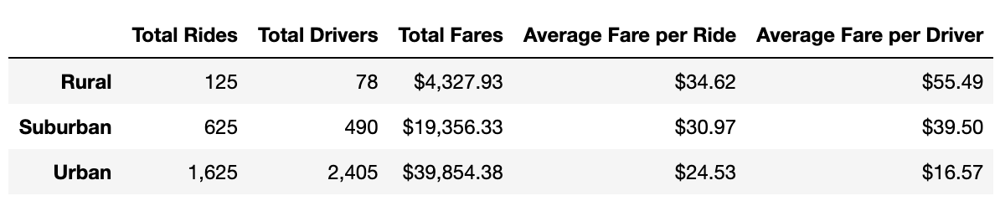
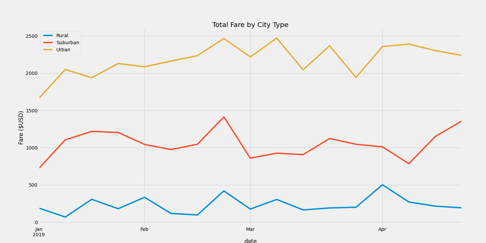

# PyBer_Analysis

## Overview

In this analysis, we continued our search to better understand how ride sharing is used differently in 3 categories of cities - Urban, Suburban, and Rural cities. This research was done to better understand the access to ridesharing services and affordability in underserved areas. At first, we were able to pinpoint that there is a difference in quantity of rides, number of drivers, and amount of fares that are made based on the city types. This data was able to give us a general snapshot over the year, but not how the usage changed during the year. In this analysis, we delved deeper into the data to understand how ride sharing use changed in the 3 categories of cities during a year. Did usage go up in the winter? Were fares higher in the summer? In this analysis we created a time plot to understand how the total fares per week changed over the year 2019. 

## Results

### Differences by City Type

The Summary DataFrame makes it easy for viewers to see the differences between the three city categories - Urban, Rural, and Suburban. By looking at the pie charts below, it is clear that Urban cities contributed the most rides, drivers, and total fares. The charts show how much each city contributed across 3 measures as a percentage of a whole. Urban cities had a total of 1,625 rides, 2,405 drivers, and $39,854 in total fares. This is more than both the Suburban and Rural cities rides, drivers, and total fares combined.

| % of Total Rides | % of Total Drivers  | % of Total Fares  |
| :-----: | :-: | :-: |
|  |  |  |

Now that it is clear that the Urban cities contribute the most rides, drivers, and total fares, we wanted to understand more aboout the cost per ride and the average fare a driver makes depending on location. In the below chart, you can see that on average, a ride in a rural city will cost $10 more than one in an urban city for the users of Pyber. But, a driver in a rural city will make on average $39 more than one in an urban city. Suburban cities tend to fall in the middle of the extremes with riders fares averaging $31 and drivers fares averaging $40.

### Total Fares Over Time

In addition to understanding cost changes aggregated over a period of time, it is important to undertand how costs change from week to week within a period of time as well. In the line chart below, the total fares are broken up by city type and mapped week-by-week from January - April 2019. Urban cities had the highest total fare per week, never dropping below $1,600 per week. Suburban cities ranged from $750 a week to $1400 and rural cities ranged from $220 to $500 per week. In addition to seeing the ranges of total fare per city, it is easy to see where peaks and lows of fares existed. The only peak that all 3 types of cities had at the same time was at the end of February, but you can see smaller peakes for urban cities at the start of March, for suburban cities at the end of April and for rural cities at the start of April.

## Summary

The goal of doing this type of research is to better inform the business about the existing disparities in access to ridesharing services and affordability in underserved areas. After completing the analysis there are 3 recommendations for addressing these disparities.
1. There is an opportunity to market more to rural and suburban cities to increase Pyber users. Once this happens, there will be a need to hire more drivers which will hopefully bring down the fares for users in rural and suburban areas.
2. There may be a need to increase the fares for urban riders in order to pay the drivers more. If they begin to see that suburban and rural drivers are being paid much more per ride, it may discourage them from working in urban cities. 
3. It may be important to do more research to better understand the cost disparities between urban, suburban, and rural cities. One differentiating factor may be the types of rides that are requested - do the rural cities request longer rides?
