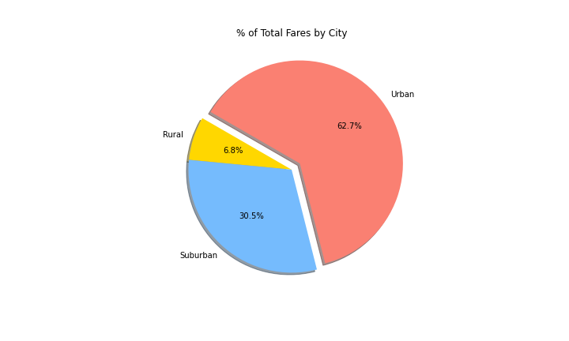
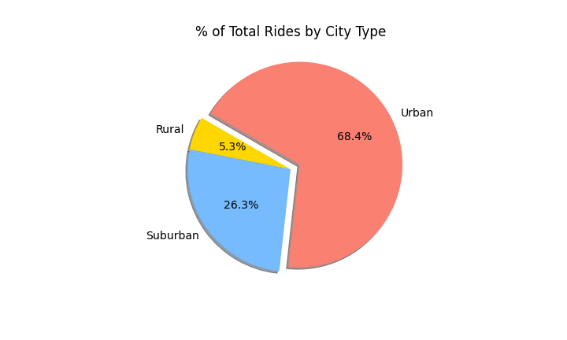
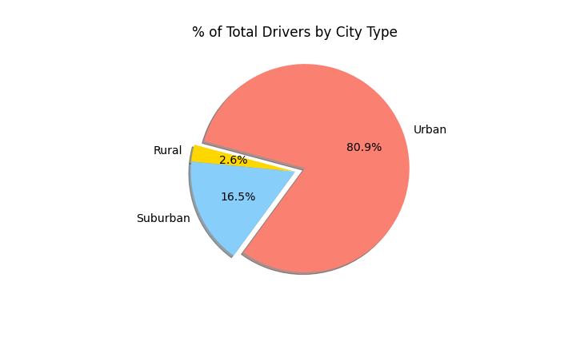

# PyBer_Analysis

## Overview

In this analysis, we continued our search to better understand how ride sharing is used differently in 3 categories of cities - Urban, Suburban, and Rural cities. This research was done to better understand the access to ridesharing services and affordability in underserved areas. At first, we were able to pinpoint that there is a difference in quantity of rides, number of drivers, and amount of fares that are made based on the city types. This data was able to give us a general snapshot over the year, but not how the usage changed during the year. In this analysis, we delved deeper into the data to understand how ride sharing use changed in the 3 categories of cities during a year. Did usage go up in the winter? Were fares higher in the summer? In this analysis we created a time plot to understand how the total fares per week changed over the year 2019. 

## Results
diff in ride sharing among different cities - total drivers, fares, avg fare per ride, driver, city type
The Summary DataFrame makes it easy for viewers to see the differences between the three city categories - Urban, Rural, and Suburban. By looking at the pie charts below, it is clear that Urban cities contributed the most rides, drivers, and total fares. Urban cities had a total of 1,625 rides, 2,405 drivers, and $39,854 in total fares. This is more than both the Suburban and Rural cities rides, drivers, and total fares combined.

| % of Total Rides | % of Total Drivers  | % of Total Fares  |
| :-----: | :-: | :-: |
|  |  |  |

### Differences by City Type

The 

### Total Fares Over Time

## Summary
3 business reccomensations for addressing disparities